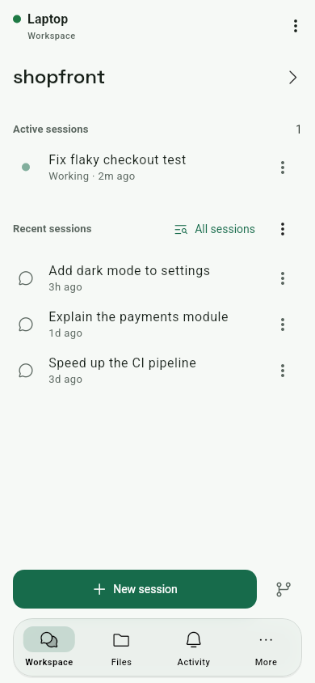
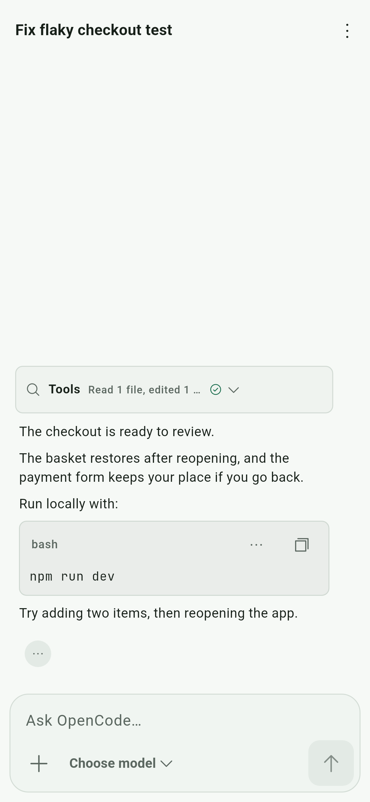
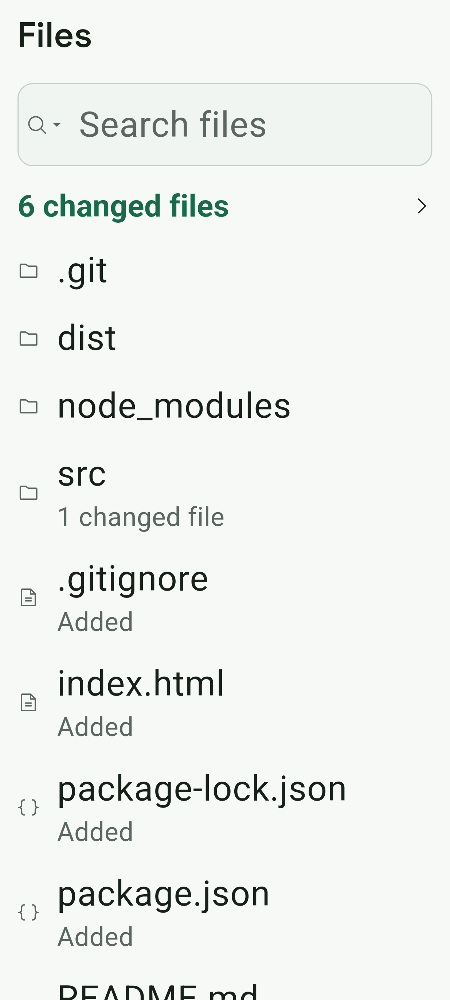
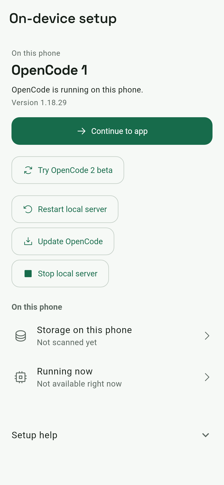
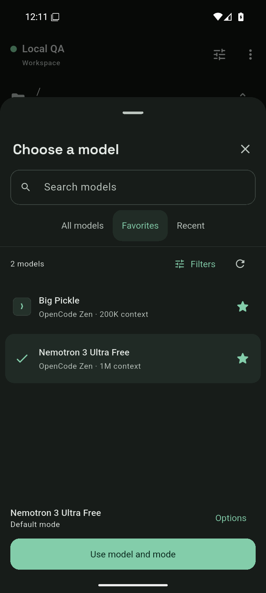
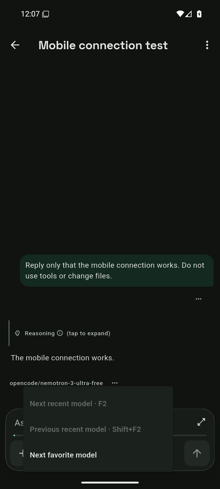
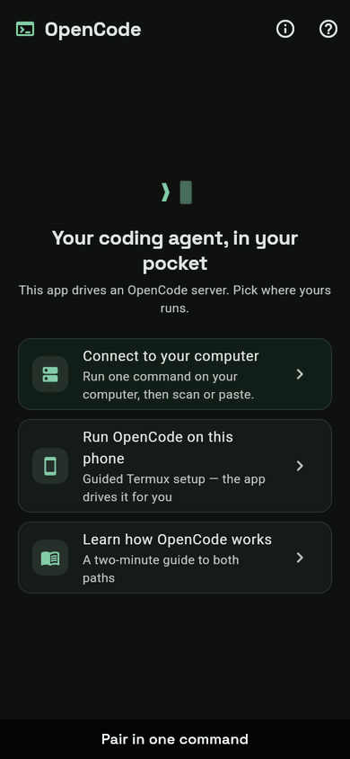

# OpenCode Mobile

[](https://github.com/Eslamasabry/opencode-mobile-next/actions/workflows/android-quality.yml)
[](https://github.com/Eslamasabry/opencode-mobile-next/actions/workflows/desktop-linux.yml)
[](LICENSE)

**Your coding agent, in your pocket. Your server, under your control.**

Start coding tasks, follow streaming answers, approve requests, and review
changes from your Android phone. OpenCode Mobile connects to
[OpenCode](https://opencode.ai) running on your computer or on the phone
itself through Termux.

**[Download Android APK — 1.0.43+49](https://github.com/Eslamasabry/opencode-mobile-next/releases/download/v1.0.43%2B49/opencode-mobile-1.0.43%2B49.apk)**
· [Release notes](https://github.com/Eslamasabry/opencode-mobile-next/releases/tag/v1.0.43%2B49)
· [Set up your connection](#getting-started)
· [See the current UI](#screenshots)
· [Get help](SUPPORT.md)

> **Stable Android release: 1.0.43+49 (September 13, 2026).**
> Primary actions are easier to find across workspace, chat and files. A detected
> Termux server offers a visible connection action, and completed setup separates
> server readiness from app connection progress, with cancellation and retry.
> [Release verification](docs/verification/stable-1.0.43-2026-09-13.md).
>
> Android is the supported release platform. Web support is in active development;
> desktop and AI Team / Gas City remain experimental.
> OpenCode Mobile is an independent community project, built with substantial AI
> assistance. It is not affiliated with or endorsed by the official OpenCode team.
> Report problems from **More → Tools & help → Report a bug** in the app.

## What it is like to use

**You talk, it works, you watch.** Answers stream in as they are written.
When the agent reads files, edits them or runs commands, you see each step as
it happens, grouped into one line you can expand ("Read 3 files, edited 1,
ran 2 commands").

**It asks before it does anything you might not want.** A permission request
appears as a small card right above where you type. One tap to allow it,
another to look closer, and the keyboard never gets pulled away from you.

**Diffs that fit a phone.** Changes wrap to the screen, with a colour bar
beside each line, so you can actually read what the agent did before you say
yes.

**Choices as buttons.** When the agent offers options, they come as buttons
you can tap, not a list you have to retype.

**Your providers, recognisable.** Providers show a favicon where available,
with a monogram fallback, a clear connected state, and server-supplied model
pricing in each model's options.

**Your go-to models, a tap away.** Star models in the picker and revisit your
eight most recent choices in the Favorites and Recent tabs. These are saved for
each server. The switch button beside the chat's model opens quick cycling;
hardware keyboards can use **F2** and **Shift+F2**. Changes made in a chat
apply to that session's next turns.

**Stay connected while Android permits.** Turn on background mode and the
notification becomes a live view of the run: which session, what the agent
is doing right now, how many things need you. On Android 16 it shows as a
live update. There is a Pause button in the shade.

**Keep your next thought.** Draft text saves as you type. The composer's **+**
menu can reuse text from earlier prompts or clear the draft with Undo. Image
attachments show thumbnails before sending; attachments themselves are not
saved with the draft.

**Let independent work continue.** When the server supports it, a Background
button appears for foreground subagents (and supported shells on OpenCode 2).
**Ctrl+B** triggers the same action from a hardware keyboard. Running agents
stay accessible above the composer. This work runs on the server and depends
on that server remaining alive.

Open **Running work** to switch to a related agent or inspect a supported
OpenCode 2 command. Read and copy its output, change its remaining timeout, or
stop it with confirmation. Output follows while the viewer is visible; scrolling
back pauses Follow so new output does not pull you away from what you are reading.

**Find the tool you need.** More groups destinations into compact rows and
searches settings, models, providers, integrations, terminal, and help.

**Share text into it.** A stack trace, a link, a message. Share from any
app and it opens a new session with that as your first prompt.

**Talk instead of type.** Voice input is transcribed on the phone. Audio
never leaves the device.

**Make it yours.** Theme packs (OpenCode green, Catppuccin, Gruvbox,
Solarized, or your phone's own Material You colours), light and dark, and a
home-screen widget that shows your sessions.

## Screenshots

Current production widgets with sample data; these screenshots illustrate the UI,
not a live model run or physical-phone storage cleanup.

| Workspace | Chat | Files | Phone setup |
| --- | --- | --- | --- |
|  |  |  |  |

### Model selection on Android

One searchable list, saved favorites, and quick switching inside each chat.
These captures come from the installed app on an Android 16 emulator connected
to a local OpenCode server.

| Browse models | Saved favorites | Switch this chat's model |
| --- | --- | --- |
|  |  |  |
<a id="linux-desktop-screenshots"></a>

| Linux desktop: Workspace | Linux desktop: Permission card | Linux desktop: Review |
| --- | --- | --- |
|  |  |  |

**Earlier UI demo (51 s, 1080p, with sound; predates 1.0.43):** [opencode-mobile-demo.mp4](video/public/opencode-mobile-demo.mp4). Phone footage uses production widgets with sample data; the Linux desktop scene was recorded live.



The same demo as a video: [video/public/demo.webm](video/public/demo.webm).

## Getting started

You need an **Android arm64 device** and either an **OpenCode server you can
reach** or **Termux on the same phone**. Configure a model provider on your
server before starting a task. The app supplies the interface; your server
and provider do the work.

### Connect to your computer

1. **Download the [stable Android APK](https://github.com/Eslamasabry/opencode-mobile-next/releases/download/v1.0.43%2B49/opencode-mobile-1.0.43%2B49.apk).**
   For an existing installation, check the signer in **Settings → About** and
   choose a matching update. Android warns about sideloading outside the Play Store.
2. **With OpenCode 2 installed on your computer, start pairing.**
   ```bash
   opencode2 pair
   ```
   It prints a QR code.
3. **Scan it in the app.** Address, username and password fill in by
   themselves. Start talking.

### Run on your phone

No computer nearby? Tap **Run OpenCode on this phone** on the welcome screen
and the app sets up OpenCode inside Termux for you. It takes ten to fifteen
minutes the first time and needs two taps from you along the way.

Connecting over the internet, using an older OpenCode 1 server, or running
the server as a service on a Linux box are all covered in
[the guide inside the app](lib/ui/screens/guide_screen.dart) and in
[docs/technical-overview.md](docs/technical-overview.md).

### If you cannot connect

- **OpenCode 1:** use manual setup in the app; `opencode2 pair` is for
  OpenCode 2. Follow the [connection guide](docs/technical-overview.md).
- **The address is `localhost`:** on a phone, that means the phone itself.
  For a computer-hosted server, use an HTTPS address reachable from the phone.
- **No models appear:** configure a provider on the server, then use
  **Refresh models** in the model picker. If a connected provider is listed
  as unloaded, use **Reload providers** there.
- **An APK will not update:** compare its certificate with **Settings → About**
  and obtain an APK with the same signer. Preserve your installation and local
  data; uninstalling is not a session-recovery step.

## Compatibility

| Surface | Release status |
|---|---|
| Android | Stable 1.0.43+49; arm64 sideload APK |
| OpenCode 1 | Supported against the current 1.18.x line |
| OpenCode 2 | Beta support targets the captured `0.0.0-beta-18600` contract; newer betas may differ |
| Linux x64 | Experimental; CI-built tarball and Debian package |
| Windows x64 | Experimental; CI artifact, no installer |
| Web | Active development; not included in this Android release |
| AI Team / Gas City | Experimental |
| iOS / macOS | Not available |

The client connects directly to a server you choose. It does not provide a
hosted OpenCode account or model subscription.

## Where things stand

The stable release covers Android. Platform and server support have these limits:

- **Android is the supported target.** The exact release candidate passed the
  full local and CI Flutter suites: 3,805 tests passed and 12 were skipped. Both
  maintainer and public APK upgrades preserved the saved profile and draft on
  Android emulators. This is not a claim of physical-phone Termux coverage.
- **The Linux build has now been run, on a virtual display.** It was launched
  on Xvfb at 1440x900 against a live OpenCode server and captured; see the
  [Linux desktop screenshots](#linux-desktop-screenshots) above. Nobody has
  run the Windows build yet. If you try it, you are the first. Please tell us
  what happened.
- **English and Arabic** are available. Localization work is tracked in
  [docs/localization-todo.md](docs/localization-todo.md).
- **Public releases and CI artifacts have different signing histories.**
  The historical `v1.0.33+34` public signer was
  `8F51FBCA8101DE600C0E878DF7E2CC65DFA29ADD58A1771D776908349CD82053`;
  its private key was lost. Current public APKs retain the certificate
  introduced in `v1.0.34+35`:
  `842284B27AA297FB74CF831779FD16498517E1BC2104451459FEC2EA7AC11D1C`.
  The maintainer's installed app and delivered `1.0.43+49` update use the stable
  CI signer **`2D010C2103CB2F78ABAACA690EAD4D45F8003A6C0A02082CD2A2AE62FD18D0EC`**.
  Replacement APKs for that installation must always retain this signer; never
  substitute or rotate it. Android updates in place require matching package ID
  and signer. Verify **Settings → About** before choosing an update.
- **Automated checks run in GitHub Actions** on `master` and `dev`. Android CI
  uploads a short-lived maintainer APK. Public downloads are built and verified
  separately against the public signer before publication.

## Your data

The app talks to the OpenCode server you choose and to nobody else about your
work. Passwords live in Android's keystore. Voice stays on the phone. Provider
logos are fetched from Google's public favicon service by domain name and
nothing more. The full picture is in [PRIVACY.md](PRIVACY.md), also inside
the app under Settings → Privacy and data use.

## For developers

Everything technical lives one level down:

- [docs/technical-overview.md](docs/technical-overview.md) — connecting in
  depth, the two server protocols, building, releasing, code layout
- [CONTRIBUTING.md](CONTRIBUTING.md) — the toolchain pin, the checks a change
  must pass, and the boundaries in the code
- [SECURITY.md](SECURITY.md) — how to report a vulnerability privately. This
  app holds server credentials and can approve shell commands. Never report
  a vulnerability in a public issue.
- [SUPPORT.md](SUPPORT.md) — where a problem belongs: this app, the OpenCode
  server, your model provider, Termux, or Shorebird

## Thanks and licence

[MIT](LICENSE). The app bundles JetBrains Mono and Space Grotesk (both
OFL-1.1), sherpa-onnx (Apache-2.0), ONNX Runtime and the Whisper models
(MIT), and the packages listed in [THIRD_PARTY_NOTICES.md](THIRD_PARTY_NOTICES.md).
Built on the shoulders of the OpenCode team, who made the agent this app is a
window onto.
