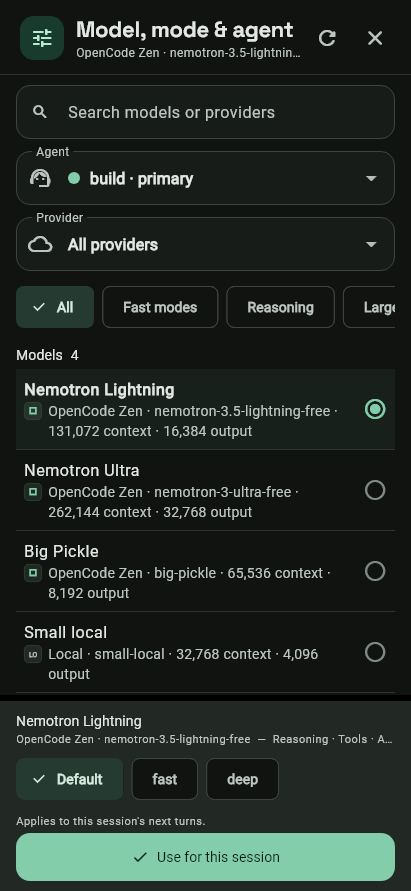
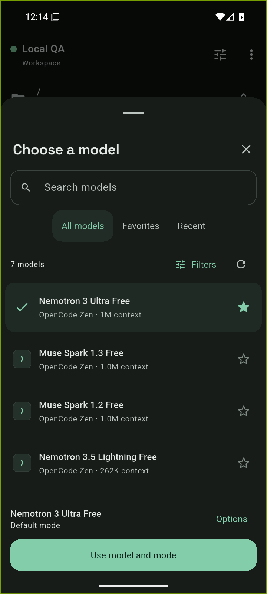
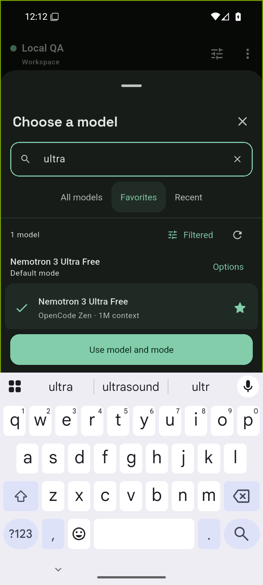
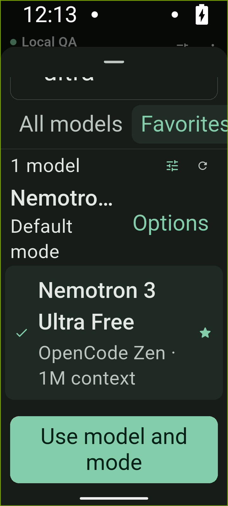

# Model picker: native visual QA

Verified on 2026-09-05 using Flutter 3.47.2 / Dart 3.13.2, an Android 16
(API 36) x86_64 AVD, and an isolated OpenCode 1.18.28 server. The Android
APK was built from this branch with `flutter build apk --debug
--target-platform=android-x64`. No provider credentials were needed: the
server exposed its free OpenCode models.

The `before-widget.png` image renders the unmodified picker from commit
`51461c2` with sample catalog data. Every `android-*.png` image is a raw
screenshot of the installed app on the AVD. They are not design mockups.

## Flows exercised

- Add a loopback server through the app's server form using `adb reverse
  tcp:4096 tcp:4096`; load the server's seven-model catalog.
- Star Big Pickle and Nemotron Ultra; confirm Favorites contains only those
  two entries and starring does not change the selected model.
- Search while the Android keyboard opens; verify the full word `ultra`
  arrives and the search retains focus. The apply action stays above the IME.
- Apply a model and send a synthetic no-tools prompt. The response streamed
  successfully: "The mobile connection works."
- Use the touch menu to cycle this chat to Big Pickle. Confirm the default
  model remains Nemotron Ultra and the chat override is stored separately.
- Force-stop and restart the app. Confirm the two favorites, MRU order, and
  chat override are restored from the profile's preferences.
- Set the AVD to 360 dp width and system font scale 2.5. Scroll to the matching
  model; confirm its row and the pinned apply action are reachable.
- Open the selected model's options; verify provider, context, output, mode,
  and agent controls. Check logcat for Flutter layout errors.

## Evidence

| Original picker (widget render) | Redesigned picker (installed Android app) |
| --- | --- |
|  |  |

| Keyboard open | 360 dp with 2.5x system text, scrolled |
| --- | --- |
|  |  |

## Automated verification

`flutter analyze --no-pub` passed. The full serial Windows run completed
with **1,361 passing tests and 9 platform-specific failures**: eight existing
Linux golden-image comparisons and the release script's Unix permission-mode
check under Git Bash. The untouched baseline reproduced the golden mismatch.
The Linux CI checks remain the source of truth for those platform-dependent
tests. The picker, keyboard, profile persistence, session scope, deletion,
localization, and accessible chat semantics checks passed.

The live AVD test used the v1 compatibility server. OpenCode 2 session behavior
is covered by the controller and widget tests; this session did not run a live
OpenCode 2 server. This is a debug APK test, not a public release signing test.