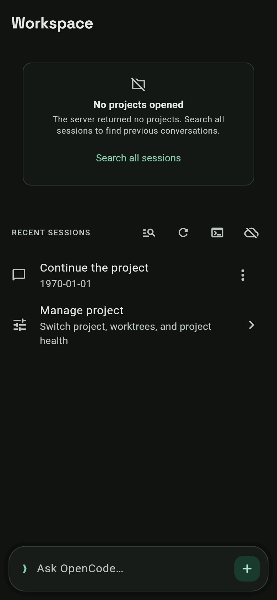

# Session access with an empty project catalog — 2026-09-07

Candidate: uncommitted `dev` working tree based on `84e1e0f`, with pre-existing
changes preserved. This slice changes Workspace, the retained-search callback
refresh in GlobalSessionsScreen, three affected test files, this note and the
capture below. Other existing GlobalSessionsScreen edits predate this slice.

Finish line: an empty project catalog must not prevent opening existing
sessions or searching the server for older conversations. Non-goal: changing
server discovery, session storage, or project selection.

## Behavior

The user confirmed Workspace showed **No projects opened**, with only Refresh,
on a CI-signed 1.0.34+35 APK. The same early-return branch exists in the public
release tag. It hid the session inventory, its errors and continuation controls,
and the global session finder. The replacement notice is inline and includes
an explicit **Search all sessions** action; existing sessions and quick-ask
remain available. Why the server returned no projects is not yet known.

Related verification found that retained global-search rows could keep callbacks
bound to the old location revision after a same-profile reconnect. Rebuilding
those callbacks preserves loaded pages while making existing rows openable.

## Toolchain correction

The initial missing-toolchain diagnosis checked the wrong Ubuntu container.
The installed SDK is `/tmp/opencode/flutter` inside `opencode-ubuntu`: upstream
Flutter 3.47.2 / Dart 3.13.2. Direct filesystem aliases now expose that SDK,
repository and existing pub cache from the agent's Ubuntu container. No SDK or
dependency upgrades were needed. This is not a verified Shorebird fork.

JDK 17.0.20, Android API 37.0 and NDK 28.2.13676358 are installed. The default
SDK AAPT2 and NDK host tools are x86-64; a separate ARM64 AAPT2 at
`/usr/lib/android-sdk/build-tools/debian/aapt2` runs and reports 2.19-debian.
Its compatibility with this Android build has not been established. Local
release signing configuration is absent; no signing secrets were accessed.

## Checks

- `flutter pub get`: passed; lockfile unchanged.
- `flutter test --no-pub --concurrency=1 test/projects_screen_test.dart`:
  **14 passed**. After the related callback fix, the four affected empty-project
  tests were rerun and passed alongside the screenshot capture (**5 passed**).
- Related serial batch: **31 passed, 6 failed**. Inventory paging (**12**) and
  localization (**2**) passed. Five global-search failures used outdated
  fixtures/expectations; the Workspace large-text fixture lacked its real
  Scaffold ancestor. These were corrected without relaxing navigation guards.
- Full `global_sessions_screen_test.dart` rerun: **15 passed**, including a new
  reconnect regression. Fixtures now use an active mock profile, mocked secure
  storage and session detail reads; refresh expectations preserve cached pages.
- Exact Workspace 2.5x text-size test rerun: **1 passed**. The other eight
  text-scale cases passed in the related batch.
- Dart formatting and scoped `git diff --check`: passed.
- `flutter analyze --no-pub`: **no issues found** (147.3 seconds).

The first nested-proot test attempt was stopped during compilation; no tests
ran. An initial screenshot name filter matched no tests; the corrected filter
passed. Neither attempt counts as test coverage. All test processes were serial.
The temporary capture test was removed before analysis.

This is focused verification, not a complete serial-suite gate. Full stable
candidate coverage, Shorebird parity, native APK compilation, and an installed
phone recovery journey remain unverified. No new APK, commit, push or tag exists.

## Visual and data checks

Capture: 390 × 844 logical pixels, real fonts, synthetic session data. The
labelled search action and existing conversation are visible without scrolling.
The 2.5x Workspace layout check passes; device screen-reader use is unverified.
Credentials, remote data and stored formats are unchanged; no migration is needed.

## Published warning

At the user's request, the existing [1.0.34+35 release](https://github.com/Eslamasabry/opencode-mobile-next/releases/tag/v1.0.34%2B35)
was renamed **[BROKEN] OpenCode Mobile 1.0.34+35 alpha** and given a prominent
session-access warning. A subsequent read verified the title and exact warning,
and that the entire original release body was preserved. Assets, tags and
signing identities were not changed. The warning distinguishes the reported
CI-signed APK from the public signer and makes no data-loss claim.

## Replacement APK delivered

The user requested a new APK and explicitly required the same signer for all
replacement APKs. This requirement is now recorded in AGENTS.md. A focused
candidate was isolated from dev in `../ocmn-session-recovery-apk`; unrelated
uncommitted features were preserved in the original worktree.

- Version: **1.0.35+36**, package `io.github.eslamasabry.opencode_mobile`.
- Source: `4cac3695ae71ea10cb12bdf3f5b28f0298727137` on
  `codex/session-recovery-apk`, [PR #77](https://github.com/Eslamasabry/opencode-mobile-next/pull/77)
  targeting dev. This candidate contains the empty-project UI fix, associated
  tests, version bump, changelog, screenshot and signer instructions. The
  unrelated uncommitted global-search changes are outside this APK candidate.
- Fresh candidate checks: dependencies resolved with unchanged lockfile;
  51 focused tests passed; analyzer reported no issues (67.9 seconds).
- Complete local serial gate: **187 files, 1,827 tests passed, 2 skipped**,
  including nested theme goldens. Sixteen bounded serial chunks completed
  against unchanged fingerprint
  `48f2395ef7d2c14337c74c22f9538072a54191ee603febbbb673f39a0d1a3384`.
  The skips were the opt-in phone context and synthetic quota preview captures.
  Manifest, per-chunk commands/logs and ledger remain at
  `/tmp/session-recovery-full-suite/`. Chunk test time totaled 949 seconds.
- [Android quality/build run](https://github.com/Eslamasabry/opencode-mobile-next/actions/runs/34087001907)
  passed, including generated SDK checks, app analysis/full tests, Linux theme
  goldens, signing identity check, Android release lint, and APK compilation.
- Downloaded artifact ID `10005895494`, produced from CI merge commit
  `cd8e35e74a422ee5c7af271945675aac58779185`. Its tree
  `db575a6b247898e2a9a0932f03f9cca2e8ae9b8d` matches the local candidate tree.
- Local apksigner verification passed, requiring exactly one signer:
  `2D010C2103CB2F78ABAACA690EAD4D45F8003A6C0A02082CD2A2AE62FD18D0EC`.
  Package, version and code were independently checked with aapt.
- APK SHA-256:
  `5ce42e112e09aad7c8ccfe0c2e8b888dca3d2f3e3f7a23f0819b265d8fbce76b`.
- Delivered file: `/storage/emulated/0/Download/opencode-mobile-1.0.35+36-ci.apk`.
  The destination checksum was checked after copying.

Nested-proot signature verification timed out; direct Java initially lacked its
installed security-configuration path. Exposing the existing JDK configuration
and running the same apksigner JAR directly completed verification. Neither
failed attempt counts as signature verification; the final report is
`/tmp/session-recovery-apk-verification-final.txt`.

This is a CI-signed replacement APK, not a new public release. No production
signing key, new tag, master update, PR merge or device installation was performed.
